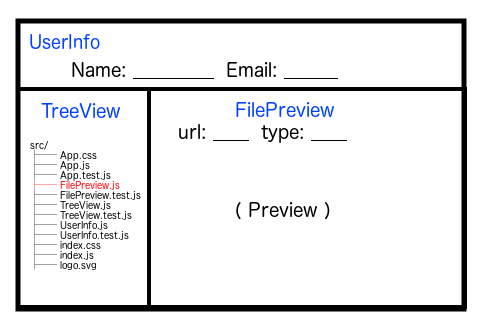

# Backblaze Associate Frontend Engineer Coding Exercise
---


## Overview

- Thank you for your interest in working at Backblaze and taking time to complete this exercise. We know your time is valuable and wish for this to be an effecient process.
- This exercise should represent the highest *code* quality that you would contribute to a production system
- This target effort timeframe should be around 3 hours. 
- There should be unit tests to account for *critical path* functionality - i.e. the main feature. See [testing with create-react-app](https://github.com/facebook/create-react-app/blob/master/packages/react-scripts/template/README.md#running-tests) for more info.
- Presentation is not important


## Project Description

- We need to create a file viewer for a user's backed up dataset
- There should be three visible components: User Info, Tree View, File Preview
- The components should be arranged in this layout:



- We will only be loading two types of files: text and images
- There will be a dummy API endpoints provided `http://localhost:3000/api/user.json`, and `http://localhost:3000/api/files.json`

## User Stories

- App
 - [x] As a user, I can see all of the components on the page

- UserInfo
	- [ ] As a user, I should be able to see my name displayed in the `UserInfo` component
	- [ ] As a user, I should be able to see my email displayed in the `UserInfo` component

- TreeView
 - [ ] As a user, I should not see any file loaded into the preview on page load
 - [ ] As a user, I can click on a file in the `TreeView` to load that file into the preview
 - [ ] As a user, I can see which file is currently selected in the `TreeView` file list

- FilePreview
 - [ ] As a user, I can see the file's properties: `url` in a relative URL format
 - [ ] As a user, I can see the file's properties: `type` in a mime type
 - [ ] As a user, I can see the file's content displayed in the `FilePreview`
 - [ ] As a user, I see a file not found message for non existent files


## Submitting the Exercise

1. Create a feature branch forked from the `develop` branch
- Merge your branch into `develop`
 - Please do not alter the `master` branch
 - Git history will not be a factor of the exercise review
- Remove the `./node_modules/` folder
- Compress the whole folder into one tarball
- Send the tarball to [Natalie](mailto:nataliec@backblaze.com)

## Open Ended Questions

- How would change the project structure to handle an arbitrary number of file types? 
- How would you optimize the project to account for users viewing the same files more than once?
- What are some optimizations that can be made to account for a large number of files?
- How could we notify the user that we cannot find the file specified?
- How would make the `FilePreview` component reusable?


---

## Getting Started

### Uncompressing project

- This exercise is a zipped git repository with no dependencies installed. You'll need to unzip the archive and install the NodeJS package dependencies.

- Unzip

```bash
$ unzip fe-exercise.zip
PUT TREE OUTPUT HERE
```

- Install Dependencies

```bash
$ cd fe-exercise
$ npm install
⸨░░░░░░░░░░░░░⸩ ⠇ fetchMetadata: [ ... misc ... ]
```

### Running the developer environment

- This project was created with Facebook's  [`create-react-app`](https://github.com/facebook/create-react-app) scaffold generator. For detailed documentation, see the project's Github page if needed.

- To start the project with built-in dev server:

```bash
$ npm start
```

You should see output similar to this:

```bash
> fe-coding-exercise@0.1.0 start /$SOME_FOLDER/fe-exercise
> react-scripts start

Compiled successfully!

You can now view fe-exercise in the browser.

  Local:            http://localhost:3000/
  On Your Network:  http://192.168.x.x:3000/

Note that the development build is not optimized.
To create a production build, use npm run build.

```

- To run tests

```bash
$ npm test
```

You should see output similar to this:

```bash
> fe-exercise@0.1.0 test /$SOME_FOLDER/fe-exercise
> react-scripts test --env=jsdom

 PASS  src/App.test.js
  ✓ renders without crashing (18ms)

Test Suites: 1 passed, 1 total
Tests:       1 passed, 1 total
Snapshots:   0 total
Time:        1.121s
Ran all test suites related to changed files.

Watch Usage
 › Press p to filter by a filename regex pattern.
 › Press t to filter by a test name regex pattern.
 › Press q to quit watch mode.
 › Press Enter to trigger a test run.

```

